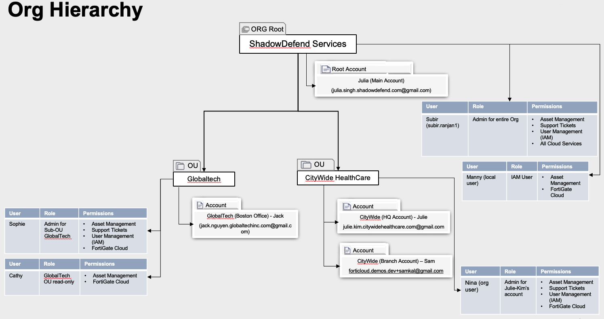



### Welcome!

In this brief workshop, we'll explore the FortiCloud Organizations feature set.  We will show examples and limitations of the Organizations capabilities.  Finally, we'll explore FortiFlex entitlements within an Org structure and provide examples of the FortiFlex API.
### Learning Objectives
- Uncover FortiCloud Organizations basic terminology and concepts
- Understand how FortiFlex operates in a multi-tenant environment
- Learn how to use the FortiFlex API to manage configurations and entitlements

### Primary Use Cases
- MSSP
  - FortiFlex licensing for customers and/or offered in MSSP Marketplaces
  - Partner/Enterprise/Customer Consolidation & Organization of (FortiCloud Accounts, Users, and Assets)
- FortiSASE
- Workshops
  - CSE POC with multi-tenant accounts and Users with FortiFlex entitlements for Cloud Products (FortiGate CNF & FortiWeb Cloud)

